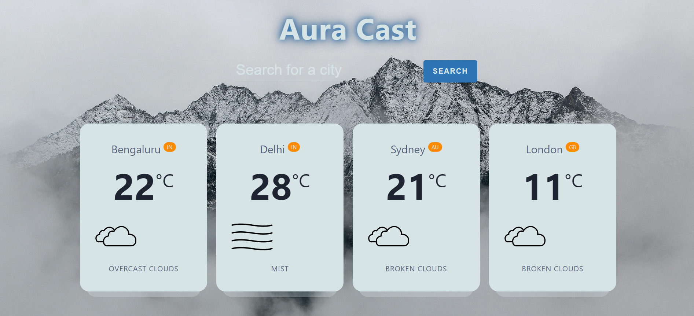

# Aura Cast 🌦️

Aura Cast is a simple weather web application built using **Node.js**, **Express.js**, and **CSS**. It allows users to search for real-time weather information by city, providing details like temperature, weather description, and country.

## Features
- Search for weather by city name.
- Displays temperature in Celsius, weather description, and an icon representing the weather.
- Simple, clean, and user-friendly interface.

## Technologies Used
- **Node.js**: Backend JavaScript runtime environment.
- **Express.js**: Web framework for Node.js.
- **Axios**: Promise-based HTTP client for making API requests.
- **OpenWeather API**: Fetches real-time weather data.
- **HTML5 & CSS**: Structure and styling of the application.
- **JavaScript**: Frontend scripting for form submission and DOM manipulation.

## Screen Shot of application

